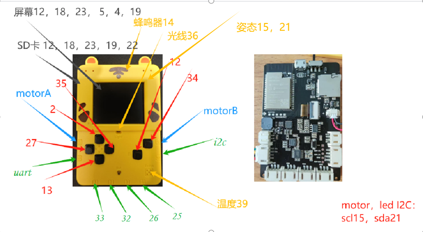

# ESP32 小喵掌机 (XiaoMiao) 

## 简介

学而思的ESP32 小喵掌机，集成 TFT 显示、MicroSD 卡、6 键输入、无源蜂鸣器、ADC 传感器、I2C、UART。



## 硬件资源一览

- 主控：ESP32
- 显示：SPI TFT（SCK/MOSI 与 SD 卡共享）
- 存储：MicroSD 卡
- 按键：6 键（上 / 下 / 左 / 右 / A/B）
- 蜂鸣器：GPIO14（无源，PWM 驱动）
- 传感器：光照（GPIO36）、热敏（GPIO39）
- 总线：I2C（GPIO15/21）、UART0（GPIO1/3）

## 引脚分配总表

### 按键（6 键）

- 上：GPIO2
- 下：GPIO13
- 左：GPIO27
- 右：GPIO35
- A：GPIO34
- B：GPIO12

### TFT 显示屏（SPI2）

- SCK：GPIO18（与 SD 卡共享）
- MOSI：GPIO23（与 SD 卡共享）
- CS：GPIO5
- DC：GPIO4
- RES：GPIO19（与 SD 卡 MISO 共享）

### MicroSD 卡（SPI2）

- SCK：GPIO18（共享）
- MOSI：GPIO23（共享）
- MISO：GPIO19（共享）
- CS：GPIO22

> TFT 与 SD 卡共用 SPI2（18/23/19），通过各自 CS 分时复用，**无冲突**。

### 无源蜂鸣器

- 引脚：GPIO14
- 驱动：PWM（LEDC），可播放不同频率音调

### 传感器（ADC）

- 光照传感器：GPIO36（ADC1_CH0，仅输入）
- 热敏电阻（温度）：GPIO39（ADC1_CH3，仅输入）

### I2C 总线

- SCL：GPIO15
- SDA：GPIO21

### UART0（原生串口，不经过 USB）

- TX：GPIO1
- RX：GPIO3

### 预留扩展

- GPIO：33、32、26、25（PH2.0 3P 座）
- 可用作 DAC / 通用 IO

## 关键限制与注意事项

- **仅输入引脚**：GPIO34、35、36、39（不可设为输出）
- **启动敏感**：GPIO12（B 键），上电阶段避免外部高电平
- **共享 SPI**：GPIO18/23/19（TFT/SD 卡），分时复用即可
- **I2C 地址**：电机 / LED 共用 0x40
- **I2S 时钟**：GPIO25、26 共用，麦克风 / 功放采样率必须一致

## MicroPython 初始化参考（示例）

```
# 按键示例
from machine import Pin
key_up = Pin(2, Pin.IN, Pin.PULL_UP)

# TFT/SD SPI
from machine import SPI
spi = SPI(2, baudrate=40000000, sck=Pin(18), mosi=Pin(23), miso=Pin(19))

# I2C
from machine import I2C
i2c = I2C(0, scl=Pin(15), sda=Pin(21))

# 蜂鸣器 PWM
from machine import PWM
buzzer = PWM(Pin(14), freq=2000, duty=512)
```

